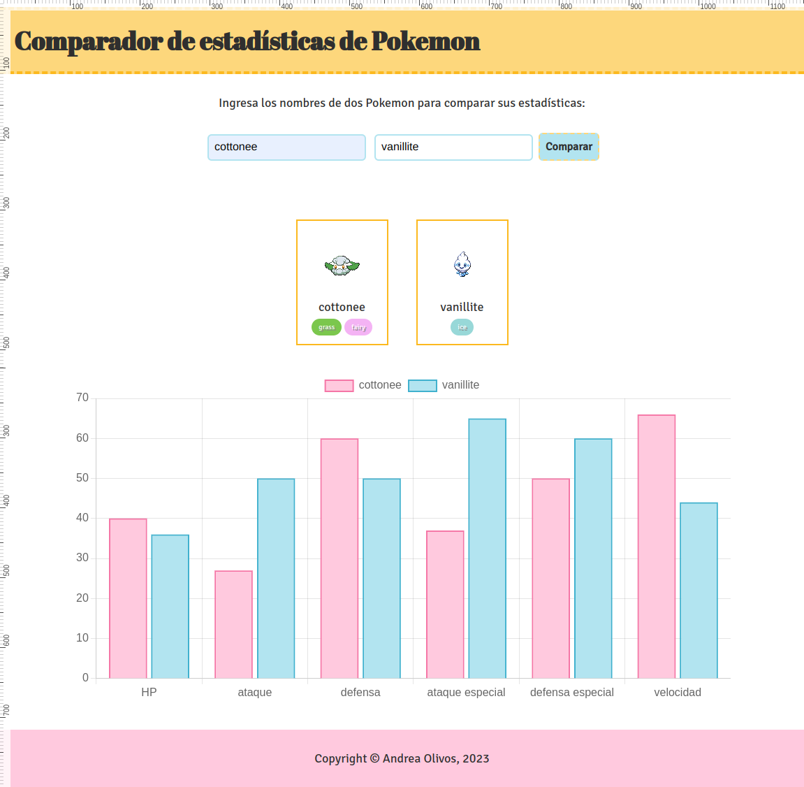

# Compare Pokemon Stats

## Description

This project is a simple app to compare pokemon stats, made to practice using asynchronous functions and making API requests. When users enter the names of two pokemon, the app requests their data to the [PokeAPI](https://pokeapi.co/) and displays a chart with their stats using [Chart.js](https://www.chartjs.org/).

## Visuals



## Starting 🚀

These instructions will help you to obtain a copy of the project and execute it on your local machine for developing and testing purposes.

### Prerequisites 📋

* Node.js
* npm

### Installation 🔧

1. Clone this repository on your local machine.

```bash
git clone https://github.com/aolivos15/P3-async.git
```

1. Navigate to the directory of the project.

```bash
cd P3-async
```

1. Install all necessary dependencies.

```bash
npm install
```

1. Start your local dev server.

```bash
npm run dev
```

1. Open [http://localhost:3000] on your browser.

## Running tests ⚙️

This project does not include automated tests. However, you can manually test all features of the compare pokemon app.

## Built with 🛠️

This project was built using the following tools:

* HTML - Website structure
* CSS - Styles
* JavaScript - Logic and functionality of the pokemon comparer
* NodeJS - JavaScript runtime environment
* Chart.js - Generating the pokemon stats chart

## License 📄

This project is under the MIT license. Check the [LICENSE](LICENSE.md) file for more details.

## Acknowledgments 🎁

This readme file has been developed using the following project as a reference:

* [template-readme-es](https://github.com/brayandiazc/template-readme) - created by [Brayan Diaz C](https://github.com/brayandiazc)

---
⌨ ️with ❤️ by [Andrea Olivos](https://github.com/aolivos15) 😊
